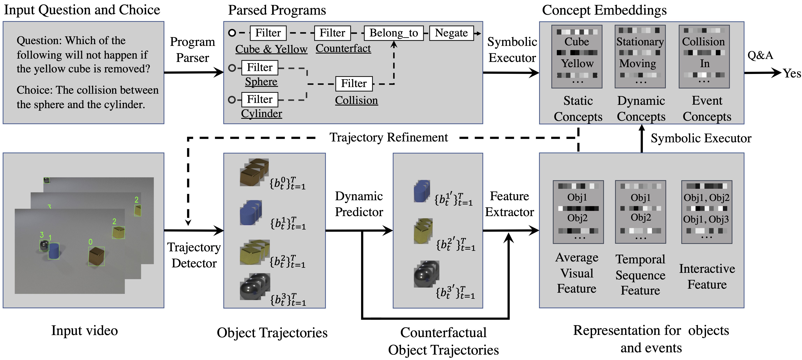

# DCL-PyTorch
Pytorch implementation for the Dynamic Concept Learner (DCL). More details can be found at the [project page](http://dcl.csail.mit.edu).

## Framework
<div align="center">
  
</div>

**[Grounding Physical Concepts of Objects and Events Through Dynamic Visual Reasoning](https://openreview.net/forum?id=bhCDO_cEGCz)**
<br />
[Zhenfang Chen](https://zfchenunique.github.io/), 
[Jiayuan Mao](http://jiayuanm.com), 
[Jiajun Wu](https://jiajunwu.com/),
[Kwan-Yee K. Wong](https://i.cs.hku.hk/~kykwong),
[Joshua B. Tenenbaum](https://web.mit.edu/cocosci/josh.html), and
[Chuang Gan](http://people.csail.mit.edu/ganchuang/)
<br />

## Prerequisites
- Python 3
- PyTorch 1.0 or higher, with NVIDIA CUDA Support
- Other required python packages specified by `requirements.txt`. See the Installation.

## Installation
Install [Jacinle](https://github.com/vacancy/Jacinle): Clone the package, and add the bin path to your global `PATH` environment variable:

```
git clone https://github.com/vacancy/Jacinle --recursive
export PATH=<path_to_jacinle>/bin:$PATH
```

Clone this repository:

```
git clone https://github.com/zfchenUnique/DCL-Release.git --recursive
```

Create a conda environment for NS-CL, and install the requirements. This includes the required python packages
from both Jacinle NS-CL. Most of the required packages have been included in the built-in `anaconda` package:

## Dataset preparation
- Download videos, video annotation,  questions and answers, and object proposals accordingly from the [official website](http://clevrer.csail.mit.edu/#)
- Transform videos into ".png" frames with ffmpeg.
- Organize the data as shown below.
    ```
    clevrer
    ├── annotation_00000-01000
    │   ├── annotation_00000.json
    │   ├── annotation_00001.json
    │   └── ...
    ├── ...
    ├── image_00000-01000
    │   │   ├── 1.png
    │   │   ├── 2.png
    │   │   └── ...
    │   └── ...
    ├── ...
    ├── questions
    │   ├── train.json
    │   ├── validation.json
    │   └── test.json
    ├── proposals
    │   ├── proposal_00000.json
    │   ├── proposal_00001.json
    │   └── ...
    ```
## Fast Evaluation
- Download the extracted object trajectories from [google drive](https://drive.google.com/file/d/18NkK29Hnu3hMPaenveB5g4Lp9WRdiIA7/view?usp=sharing).
- Git clone the dynamic model, download [image proposals](http://clevrer.csail.mit.edu/#) and [the pretrained propNet models](https://drive.google.com/drive/folders/16FnmnZBb11ge_gJNWUMp8EACRZ5nKe-W?usp=sharing) and make dynamic prediction by 
```
    git clone https://github.com/zfchenUnique/clevrer_dynamic_propnet.git
    cd clevrer_dynamic_propnet
    sh ./scripts/eval_fast_release_v2.sh 0
```
- Download [the pretrained DCL model](https://drive.google.com/file/d/11JwFcmC1wYR7L1kSfM3avCwnHqZ-nA7l/view?usp=sharing) and [parsed programs](https://drive.google.com/drive/folders/1dydkLN1A9GWTaMK8QaxpWs6Pt4Eszsaw?usp=sharing). 
```
   sh scripts/script_test_prp_clevrer_qa.sh 0
```
- Get the accuracy on [evalAI](https://eval.ai/web/challenges/challenge-page/667/overview).

## Step-by-step Training
- Step 1: download the [proposals](http://clevrer.csail.mit.edu/#) from the region proposal network and extract object trajectories for train and val set by
```
   sh scripts/script_gen_tubes.sh
```
- Step 2: train a concept learner with descriptive and explanatory questions for static concepts (i.e. color, shape and material)
```
   sh scripts/script_train_dcl_stage1.sh 0
```
- Step 3: extract static attributes & refine object trajectories
extract static attributes
```
   sh scripts/script_extract_attribute.sh
```
refine object trajectories
```
   sh scripts/script_gen_tubes_refine.sh
```
- Step 4: extract predictive and counterfactual scenes by
```
    cd clevrer_dynamic_propnet
    sh ./scripts/train_tube_box_only.sh # train
    sh ./scripts/train_tube.sh # train
    sh ./scripts/eval_fast_release_v2.sh 0 # val
```
- Step 5: train DCL with all questions and the refined trajectories
```
   sh scripts/script_train_dcl_stage2.sh 0
```

## Generalization to CLEVRER-Grounding
- Step 1: download [expression annotation](https://drive.google.com/file/d/12CKy0AK_eWnf86gyWpWMC1Zyo9iATFcz/view?usp=sharing) and [parsed programs](https://drive.google.com/file/d/1EGu97lQR-MDyyjkhoaLyhRnqbqLxGCtz/view?usp=sharing) from google drive
- Step 2: evaluate  the performance on CLEVRER-Grounding 
```
    sh ./scripts/script_grounding.sh  0
    jac-crun 0 scripts/script_evaluate_grounding.py
```
## Generalization to CLEVRER-Retrieval
- Step 1: download [expression annotation](https://drive.google.com/file/d/1mzSRnG6ufI_YRhbfH7Oj1i4cR5e4ty-S/view?usp=sharing) and [parsed programs](https://drive.google.com/file/d/1T0aVJNjVI7xyJQbnao9pffDOj1Puys_o/view?usp=sharing) from google drive
- Step 2: evaluate  the performance on CLEVRER-Retrieval
```
    sh ./scripts/script_retrieval.sh  0
    jac-crun 0 scripts/script_evaluate_retrieval.py
```
## Extension to Tower Blocks
- Step 1: download [question annotation](https://drive.google.com/drive/folders/11ai3w-6kyLdgDdM3S3UjIeqGWPh0aILP?usp=sharing) and [videos](https://www.dropbox.com/sh/8n00jyzo0m2slxe/AAChn5uB5g4HHu2mZxbapgzsa?dl=0) from google drive
- Step 2: train on Tower block QA
```
    sh ./scripts/script_train_blocks.sh 0
```
- Step 3: download the [pretrain model](https://drive.google.com/file/d/1mzSRnG6ufI_YRhbfH7Oj1i4cR5e4ty-S/view?usp=sharing) from google drive and evaluate  on Tower block QA
```
    sh ./scripts/script_eval_blocks.sh 0
```
## Others
- [Qualitative Results](https://dynamicconceptlearner.github.io)
- [CLEVRER-Grounding training set Annotation](https://drive.google.com/drive/folders/1nvU5knMJO2lv8TgWPHw4nUnHqhf3_fB_?usp=sharing)
- [CLEVRER-Retrieval training set Annotation](https://drive.google.com/drive/folders/1Krj9I6n-4mo_uAqPgSTVlpE1Zz3Bl_Xc?usp=sharing)

## Citation
If you find this repo useful in your research, please consider citing:
```
@inproceedings{zfchen2021iclr,
    title={Grounding Physical Concepts of Objects and Events Through Dynamic Visual Reasoning},
    author={Chen, Zhenfang and Mao, Jiayuan and Wu, Jiajun and Wong, Kwan-Yee K and Tenenbaum, Joshua B. and Gan, Chuang},
    booktitle={International Conference on Learning Representations},
    year={2021}
    }
```
